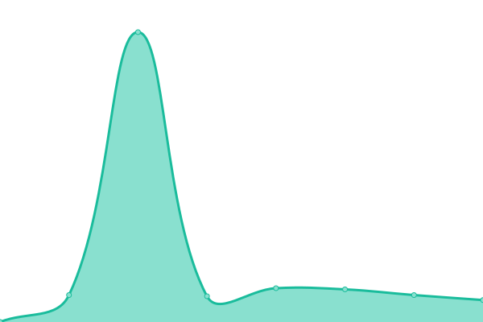

# [📈 Live Status](https://esdraspavon.github.io/picker-status): <!--live status--> **🟧 Partial outage**

This repository contains the open-source uptime monitor and status page for [Esdras Pavon](https://esdraspavon.com), powered by [Upptime](https://github.com/upptime/upptime).

With [Upptime](https://upptime.js.org), you can get your own unlimited and free uptime monitor and status page, powered entirely by a GitHub repository. We use [Issues](https://github.com/esdraspavon/picker-status/issues) as incident reports, [Actions](https://github.com/esdraspavon/picker-status/actions) as uptime monitors, and [Pages](https://esdraspavon.github.io/picker-status) for the status page.

<!--start: status pages-->
<!-- This summary is generated by Upptime (https://github.com/upptime/upptime) -->
<!-- Do not edit this manually, your changes will be overwritten -->
<!-- prettier-ignore -->
| URL | Status | History | Response Time | Uptime |
| --- | ------ | ------- | ------------- | ------ |
|  [Picker](https://www.pickerexpress.com) | 🟩 Up | [picker.yml](https://github.com/esdraspavon/picker-status/commits/HEAD/history/picker.yml) | 

 250ms
     
 | 

<a href="https://status.pickerexpress.com/history/picker">100.00%</a>
    

|  [Dashboard - Picker](https://dashboard.pickerexpress.com) | 🟩 Up | [dashboard-picker.yml](https://github.com/esdraspavon/picker-status/commits/HEAD/history/dashboard-picker.yml) | 

 141ms
     
 | 

<a href="https://status.pickerexpress.com/history/dashboard-picker">100.00%</a>
    

|  [Share My Ride - Picker](https://smr.pickerexpress.com) | 🟩 Up | [share-my-ride-picker.yml](https://github.com/esdraspavon/picker-status/commits/HEAD/history/share-my-ride-picker.yml) | 

 495ms
     
 | 

<a href="https://status.pickerexpress.com/history/share-my-ride-picker">100.00%</a>
    

|  [API - Picker](https://api.pickerexpress.com/user/pingMe) | 🟥 Down | [api-picker.yml](https://github.com/esdraspavon/picker-status/commits/HEAD/history/api-picker.yml) | 

 420ms
     
 | 

<a href="https://status.pickerexpress.com/history/api-picker">99.99%</a>
    

|  [Dashboard API - Picker](https://api.pickerexpress.com/user/pingMe) | 🟩 Up | [dashboard-api-picker.yml](https://github.com/esdraspavon/picker-status/commits/HEAD/history/dashboard-api-picker.yml) | 

 98ms
     
 | 

<a href="https://status.pickerexpress.com/history/dashboard-api-picker">100.00%</a>
    

<!--end: status pages-->

[**Visit our status website →**](https://esdraspavon.github.io/picker-status)

## 📄 License

- Powered by: [Upptime](https://github.com/upptime/upptime)
- Code: [MIT](./LICENSE) © [Esdras Pavon](https://esdraspavon.com)
- Data in the `./history` directory: [Open Database License](https://opendatacommons.org/licenses/odbl/1-0/)
